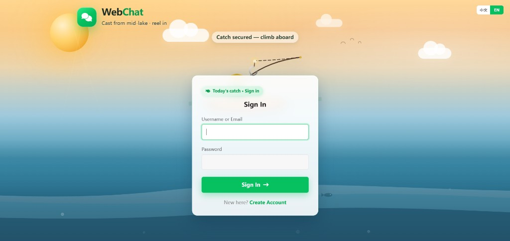
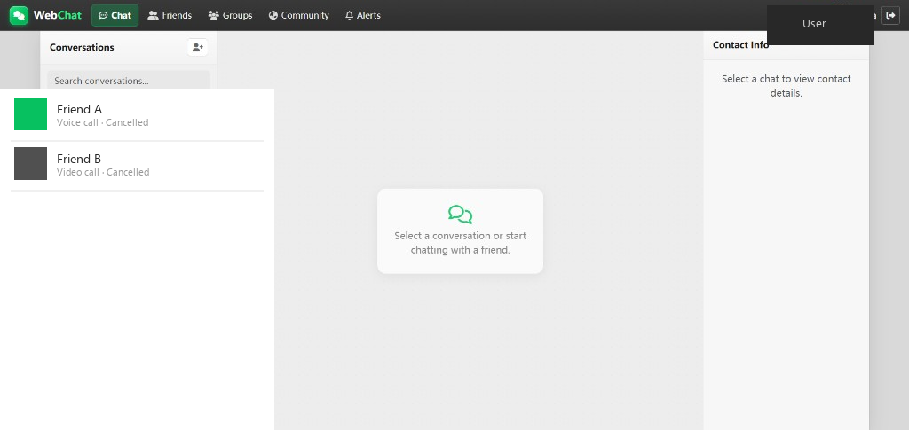
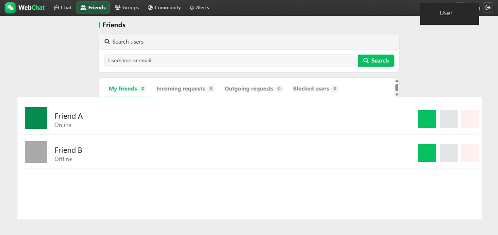
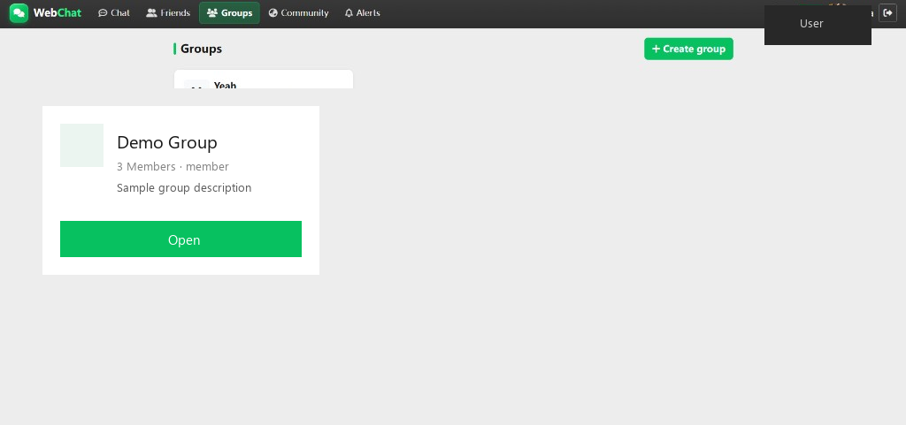
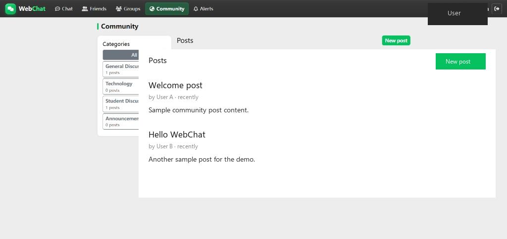
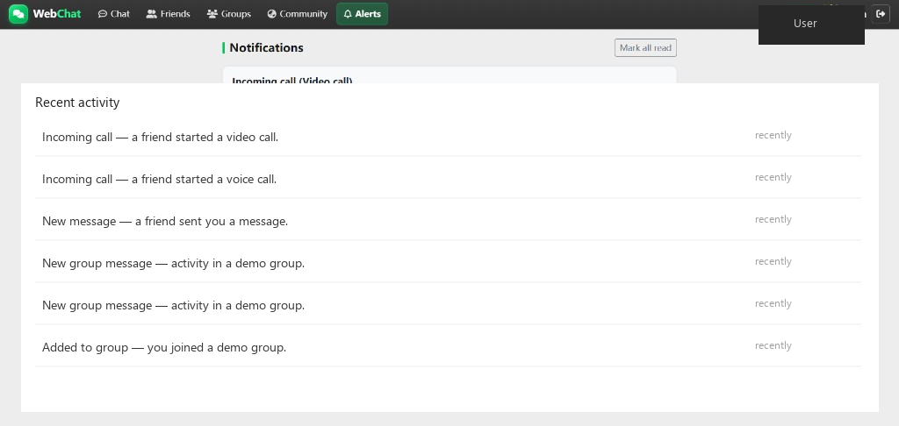

# WebChat — Chat · Voice · Video

Browser messaging platform with private chat, groups, voice notes, file sharing, WebRTC voice/video calls, community forums, and a separate admin panel.

Built with **PHP 8.2+**, **MySQL/MariaDB**, **Bootstrap 5**, **vanilla JavaScript**, and **WebRTC** (no Node.js / Socket.IO).

---

## Quick start (XAMPP)

1. Place the project at `C:\xampp\htdocs\project\WebChat` (or another path — keep `APP_URL` in sync).
2. Copy `includes/config.local.example.php` → `includes/config.local.php` and fill in DB credentials.
3. Start **Apache** and **MySQL** in XAMPP.
4. Import `database/database.sql` in phpMyAdmin (creates database `webconnect`).
5. Open http://localhost/project/WebChat
6. Register a normal user on the front end. Admin: http://localhost/project/WebChat/admin/login.php  
   Default admin: `admin` / `admin123` (change after first login).
7. Add friends → private / group chat → try voice or video (allow mic/camera in the browser).

Typical local `config.local.php`:

```php
define('DB_HOST', '127.0.0.1');
define('DB_NAME', 'webconnect');
define('DB_USER', 'root');
define('DB_PASS', '');
define('APP_URL', 'http://localhost/project/WebChat');
define('APP_DEBUG', true);
```

Phone testing over a tunnel: see `docs/cloudflare-tunnel.md`.

---

## Features

- User registration / login (`password_hash` / `password_verify`)
- Profiles, avatars, status messages
- Friend requests, friendships, blocking
- Private chat: text, image, file, voice, emoji picker
- Replies, reactions, delete, delivery / read status
- Typing indicators and online / away presence (AJAX polling)
- Group chats with **Owner / Admin / Member** roles
- WebRTC **voice & video** calls (PHP signalling + short polling)
- Notifications centre
- Community forums (posts, comments, likes, shares, reports)
- Separate admin auth: users, forums, reports
- English / 中文 UI switch
- Mobile-friendly chat and call UI

---

## Screenshots

Screenshots below use placeholder names (no real account data).

| Login | Chat |
|:---:|:---:|
|  |  |

| Friends | Groups |
|:---:|:---:|
|  |  |

| Community | Alerts |
|:---:|:---:|
|  |  |

---

## Folder structure

```text
WebChat/
├── admin/                 Admin panel (separate session)
├── api/                   JSON endpoints (chat, calls, upload, …)
├── assets/css & js        Frontend
├── database/
│   ├── database.sql       Local XAMPP import (creates DB)
│   └── cpanel_import.sql  cPanel import (no CREATE DATABASE)
├── docs/screenshots/      README previews
├── includes/              Config, auth, security, layout
├── lang/                  en.php · zh.php
├── uploads/               Private media (via api/media.php)
├── logs/
├── deploy_check.php       One-time production checker (delete after use)
├── LICENSE
└── README.md
```

---

## 1. XAMPP setup

1. Copy the project to:

   ```text
   C:\xampp\htdocs\project\WebChat
   ```

2. Start **Apache** and **MySQL**.

3. Import schema:

   - phpMyAdmin → Import → `database/database.sql`  
   - Or CLI:

   ```bash
   C:\xampp\mysql\bin\mysql.exe -u root -p < database\database.sql
   ```

4. Create local config:

   ```text
   includes/config.local.example.php  →  includes/config.local.php
   ```

5. Ensure writable folders:

   ```text
   uploads/avatars · images · files · voices · groups
   logs/
   ```

6. Open:

   | Page | URL |
   |------|-----|
   | App | http://localhost/project/WebChat |
   | Admin | http://localhost/project/WebChat/admin/login.php |

### Demo admin

| Role | Username | Password |
|------|----------|----------|
| Admin | `admin` | `admin123` |

Locally you may enable `ALLOW_DEMO_ADMIN_SEED` and use **One-click fill admin / admin123** on the admin login page.  
No demo end-user accounts are seeded — register from the UI.

---

## 2. Everyday use

1. Register two or more users and send friend requests
2. Open **Chat** for private messages (text / image / file / voice / emoji)
3. Create a **Group**, invite friends, manage Owner / Admin roles
4. Start a **voice** or **video** call from the chat header
5. Use **Community** forums; moderate reports under `/admin/`
6. Switch language with the EN / 中文 control in the navbar

---

## 3. Voice & video calls (WebRTC)

1. Caller creates a call session in MySQL  
2. Callee polls for incoming calls and accepts  
3. SDP / ICE signals are stored and polled (`api/calls.php`)  
4. Browsers connect peer-to-peer (STUN; TURN when needed)

Requirements:

- Browser permission for **microphone** (and **camera** for video)
- **HTTPS** on any non-localhost host
- Public STUN is included; some mobile networks need a real **TURN** server — override `RTC_ICE_SERVERS` in `config.local.php` if calls fail across NAT

Tips: keep both devices on the call screen while connecting; if the mic is “in use”, close Zoom / Teams / other tabs holding the device.

---

## 4. cPanel deployment

**Needs:** Apache, PHP **8.0+** (`pdo_mysql`, `fileinfo`, `json`, `openssl`, `mbstring`), MySQL/MariaDB, **HTTPS**.

### Database

1. Create DB + user in cPanel → grant **ALL PRIVILEGES**
2. Import **`database/cpanel_import.sql`** (do **not** use `database.sql` — it runs `CREATE DATABASE`)
3. Default admin after import: **`admin` / `admin123`** — change immediately

### Upload files

Upload to `public_html` (or a subfolder such as `public_html/webchat`).

**Do not upload** your local `includes/config.local.php` (XAMPP passwords / debug / tunnel flags).

On the server:

```text
includes/config.local.example.php  →  includes/config.local.php
```

```php
define('DB_HOST', 'localhost');
define('DB_NAME', 'cpaneluser_dbname');
define('DB_USER', 'cpaneluser_dbuser');
define('DB_PASS', 'your_db_password');
define('APP_URL', 'https://your-domain.com'); // or https://domain.com/webchat
define('APP_DEBUG', false);
define('ALLOW_DEMO_ADMIN_SEED', false);
define('APP_URL_AUTO', false);
define('APP_BASE_PATH', '');
```

### Permissions

Writable: `uploads/` (+ subfolders), `logs/` (`755` / `775`).

### HTTPS

1. Enable AutoSSL / install a certificate  
2. Uncomment the HTTPS redirect block in root `.htaccess`  
3. Mic / camera will **not** work on plain `http://` outside localhost

### Verify

1. Open `https://your-domain.com/deploy_check.php` once  
2. Fix any `[FAIL]` lines  
3. **Delete `deploy_check.php` immediately**  
4. Smoke test: register → friends → chat → upload → call → forum → admin login

### Security checklist

- [ ] Local `config.local.php` was **not** uploaded  
- [ ] `APP_DEBUG = false`  
- [ ] `APP_URL_AUTO = false`  
- [ ] Demo admin seed disabled  
- [ ] Admin password changed from `admin123`  
- [ ] `deploy_check.php` deleted  

---

## 5. Polling (no WebSockets)

| Channel | Approx. interval |
|---------|------------------|
| Chat messages | ~2.8s |
| Incoming calls | ~0.8s |
| Call signalling (active) | ~0.4–1.2s |
| Notifications | ~15s |
| Presence heartbeat | ~25s |

Typing indicators expire after a few seconds (`TYPING_TTL_SECONDS`).

---

## 6. System flow

1. User registers / logs in (session + CSRF)  
2. Friends link two accounts  
3. Messages / uploads go through `api/` into MySQL  
4. Clients poll for messages, presence, and notifications  
5. Calls exchange WebRTC signals via polling; media is peer-to-peer  
6. Admins manage users, forums, and reports in `/admin/`

---

## Security notes

- PDO prepared statements  
- CSRF tokens on state-changing requests  
- Session regeneration on login; HttpOnly + SameSite cookies  
- Output escaped with `htmlspecialchars`  
- Uploads checked by extension, MIME, and size; random filenames  
- Private files only via authenticated `api/media.php`  
- Rate limits on login, messages, friends, forums, calls, uploads  
- `includes/config.local.php` is gitignored — never commit production secrets  

---

## Requirements

| Environment | Notes |
|-------------|--------|
| Local | XAMPP, PHP 8.2+, modern browser, mic/camera for calls |
| Production | Apache, PHP 8.0+, MySQL/MariaDB, **HTTPS** |

Timezone default: `Asia/Kuala_Lumpur` (`includes/config.php`).

---

## License

This project is licensed under the [MIT License](LICENSE).

Independent student / portfolio project. Do not copy proprietary messenger source code.  
Change branding, admin password, and TURN settings before public production use.
